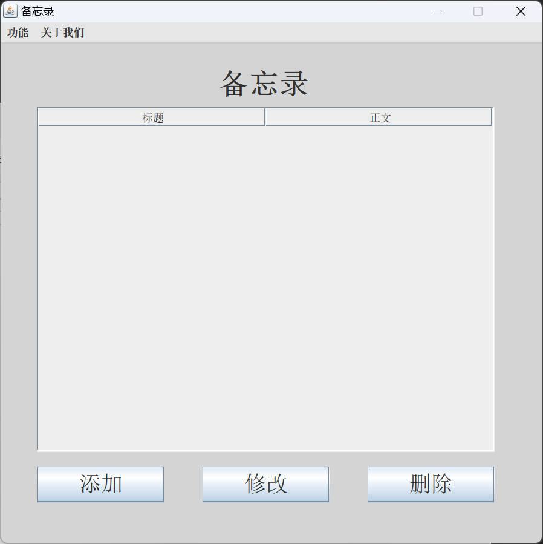
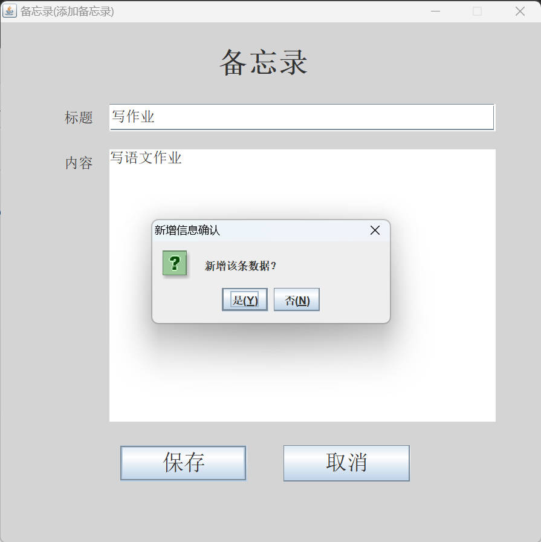
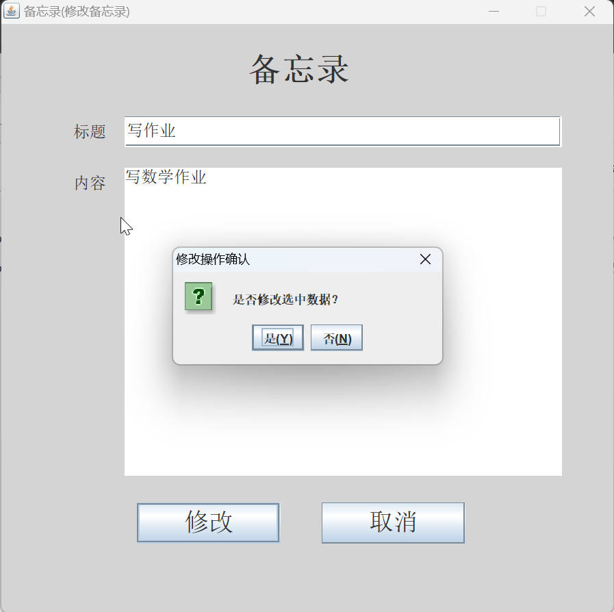
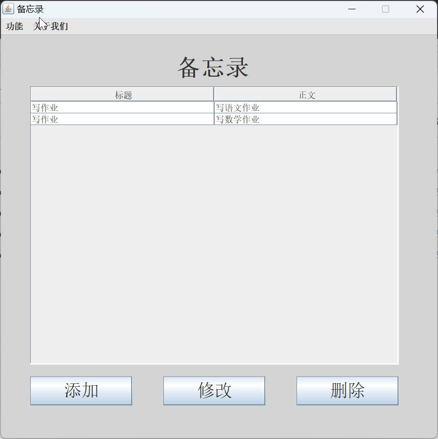
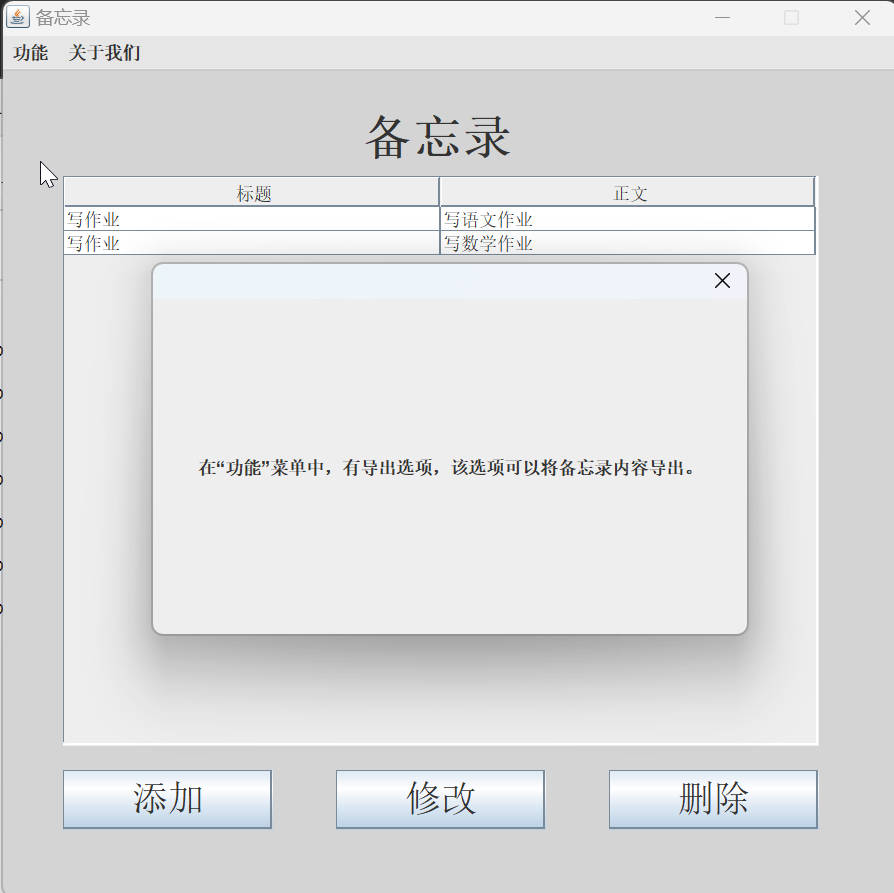
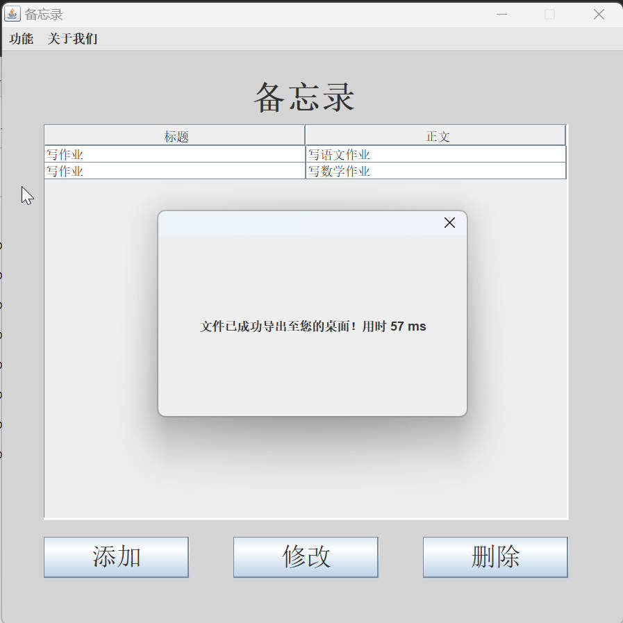
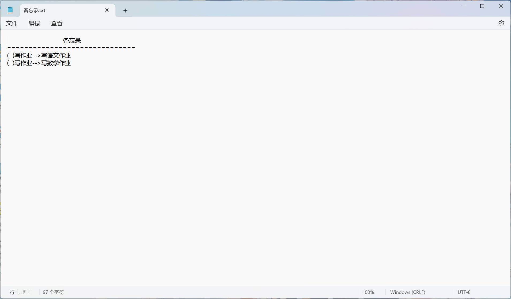

# SimpleMemo

## 一、简介
SimpleMemo 是一个简单的备忘录应用程序，提供添加、修改、删除和导出备忘的功能。它使用 Java 编写，并利用了序列化技术来存储和读取数据。

## 二、功能简介

### 1. 添加
用户可以添加新的备忘记录，包括标题和内容。

### 2. 修改
用户可以修改已有的备忘记录。

### 3. 删除
用户可以删除不再需要的备忘记录。

### 4. 导出
用户可以将备忘记录导出为文件。

## 三、技术特点

### 技术栈
- **Java**：用于编写应用程序的核心逻辑。
- **Swing**：用于构建图形用户界面（GUI）。
- **序列化**：用于将备忘记录持久化存储到文件中，并能够重新读取。

## 四、使用方法
1. 运行 `App.java` 启动应用程序。
2. 使用主界面中的按钮进行添加、修改、删除和导出操作。
3. 所有备忘记录将被保存在 `data.txt` 文件中。

## 五、运行截图
<table style="border:0;padding: 0;border-collapse: collapse">
   <tr>
      <td>
         
      </td>
      <td>
         
      </td>
   </tr>
   <tr>
      <td>
         
      </td>
      <td>
         
      </td>
   </tr>
   <tr>
      <td>
         
      </td>
      <td>
          
      </td>
   </tr>
   <tr>
      <td>
          
      </td>
      <td>
          
      </td>
   </tr>
   <tr>
      <td>
          
      </td>
   </tr>
</table>
          

## 六、许可
本项目遵循 MIT 许可协议。详细信息请参阅 [LICENSE.lic](LICENSE.lic) 文件。

## 七、致谢
感谢所有为本项目提供帮助和支持的人。