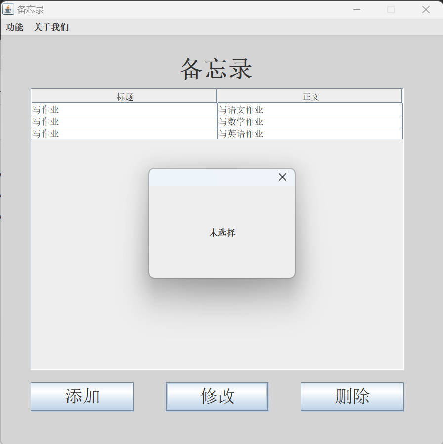
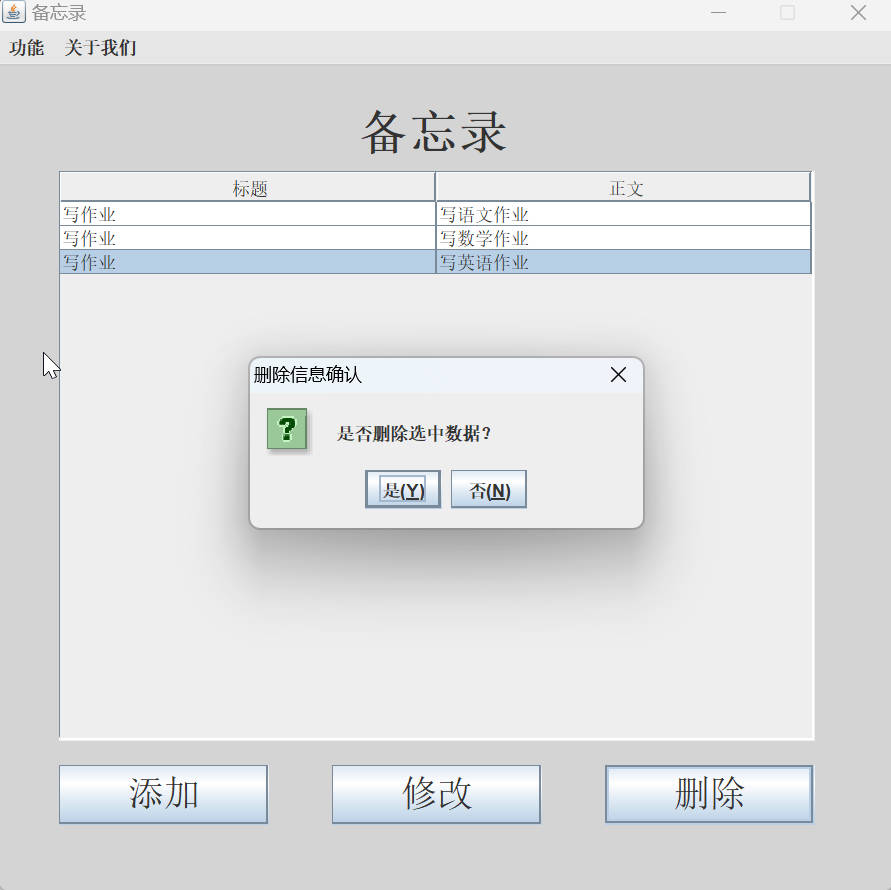
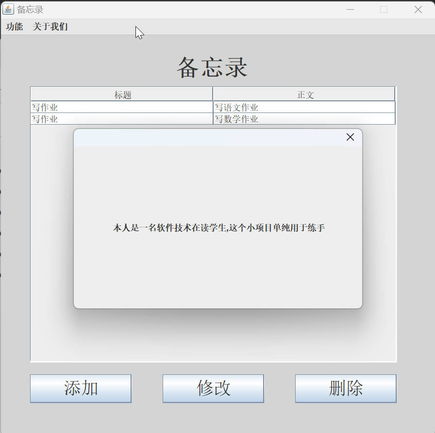

  

<h1 align="center">SimpleMemo</h1>

A lightweight desktop memo application built with Java Swing

  <a href="./README.md">简体中文</a> |
  <a href="./README_EN.md">English</a>

## Overview

SimpleMemo is a small desktop memo application with a very direct goal: store short notes locally and provide basic
operations such as add, edit, delete, and export. The project is implemented with native Java desktop UI components and
does not rely on any heavy framework, so it also works well as a beginner-friendly Java Swing practice project.

From the actual source code, the project follows this flow:

1. Launch `App.java` to open the main window.
2. Read local memo data and display it in a `JTable`.
3. Use separate windows for creating and editing memos.
4. Persist data locally through Java object serialization.
5. Export all memos into a `.txt` file on the desktop.

## Features

### 1. Memo List Display

- The main window reads memo data from `src/data.txt`.
- Data is shown in a table with two columns: `Title` and `Content`.
- A scroll pane is used so the list remains viewable when there are many records.

### 2. Add Memo

- Click the `Add` button in the main window to open the add form.
- Both title and content are required.
- After confirmation, the new memo is saved into the local data file.

### 3. Edit Memo

- Select a row in the main window and click `Update`.
- The edit window pre-fills the selected memo's title and content.
- Once confirmed, the target object is updated and the full collection is written back to disk.

### 4. Delete Memo

- Select a memo and click `Delete`.
- A confirmation dialog is shown before deletion.
- After deletion, the main window is refreshed to display the latest data.

### 5. Export to Text File

- Use `Function -> Export` in the menu bar to export all memos to the desktop.
- The exported file name is fixed as `备忘录.txt`.
- The program writes all memo entries into a plain text file for easier viewing outside the app.

### 6. Simple Dialog Feedback

- The `About Us` menu includes `Author Intro` and `Project Intro`.
- `MyJDialog` is used as a small dialog helper for prompt-style messages.
- It is also used for cases such as empty input, missing selection, and export completion feedback.

## Tech Stack

| Technology / Component          | Description                                                                            |
|---------------------------------|----------------------------------------------------------------------------------------|
| Java SE                         | Core language used for business logic, file IO, and object management                  |
| Swing / AWT                     | Desktop GUI toolkit for windows, buttons, tables, menus, and dialogs                   |
| Java IO                         | Used for local file reading, writing, and text export                                  |
| Object Serialization            | `ObjectInputStream` / `ObjectOutputStream` persist `ArrayList<Memo>` locally           |
| IntelliJ IDEA project structure | The repository includes `.iml` and `.idea` files, so it can be opened directly in IDEA |

## Core Implementation

### Data Storage

- Memo data is stored in `src/data.txt`.
- The file is not plain text. It stores a serialized `ArrayList<Memo>`.
- On first run, if the file does not exist or is empty, the program initializes it with an empty collection.

### UI Structure

- `Main`: main window for list display, menu actions, and entry points to add/edit/delete.
- `Add`: window for creating a new memo.
- `Update`: window for editing an existing memo.
- `MyJDialog`: shared helper for prompt dialogs.

### Data Flow

- Reading data is handled by `General.readMemoFile()`.
- Adding a memo uses `General.saveOneMemo()`.
- Updating a memo changes the target object and then calls `General.saveAllMemos()`.
- Deleting a memo uses `General.deleteMemo()`.
- Exporting uses `General.download()`.

## Directory and File Guide

| Path                                   | Description                                                          |
|----------------------------------------|----------------------------------------------------------------------|
| `src/App.java`                         | Application entry point, opens the main window                       |
| `src/commons/Memo.java`                | Memo entity class with title, content, and serialization support     |
| `src/commons/General.java`             | Utility class for reading, saving, deleting, and exporting memo data |
| `src/uis/Main.java`                    | Main window with table display, menu bar, and button event handling  |
| `src/uis/Add.java`                     | Add memo window                                                      |
| `src/uis/Update.java`                  | Edit memo window                                                     |
| `src/views/MyJDialog.java`             | Custom dialog helper                                                 |
| `src/data.txt`                         | Local data file storing serialized memo objects                      |
| `src/META-INF/MANIFEST.MF`             | JAR manifest file, defines `App` as the main class                   |
| `asserts/`                             | Assets used by the README, including the logo and screenshots        |
| `release/SimpleMemo V1.1.3 setup .exe` | Prebuilt Windows installer                                           |
| `out/`                                 | Compiled output directory                                            |
| `.idea/`, `SimpleMemo.iml`             | IntelliJ IDEA project metadata                                       |

## How to Run

### Option 1: Run from Source

The recommended way is to open the project with IntelliJ IDEA and run `src/App.java` directly.

A few practical notes:

- Keep the working directory at the project root, otherwise the relative path `src/data.txt` may not resolve correctly.
- The project uses local file persistence only, so no database or external service is required.

### Option 2: Use the Installer

A Windows installer is already included in the repository:

- `release/SimpleMemo V1.1.3 setup .exe`

If you just want to try the app quickly, this is the easiest route.

## Screenshots

  <table align="center">
    <tr>
      <td align="center" width="50%"></td>
      <td align="center" width="50%"></td>
    </tr>
    <tr>
      <td align="center" width="50%"></td>
      <td align="center" width="50%"></td>
    </tr>
    <tr>
      <td align="center" width="50%"></td>
      <td align="center" width="50%"></td>
    </tr>
    <tr>
      <td align="center" width="50%"></td>
      <td align="center" width="50%"></td>
    </tr>
    <tr>
      <td align="center" width="50%"></td>
      <td align="center" width="50%"></td>
    </tr>
  </table>

## About This Project

This was originally a student practice project built shortly after finishing related coursework. Its main purpose was to
practice Java basics, Swing GUI programming, event handling, object serialization, and file operations.

Because of that, some parts of the code still clearly reflect a learning stage. There are places that are not especially
polished, and there may still be bugs or design decisions that feel a bit rough today. I chose not to over-process those
traces completely, because they are part of what this project really was at that time. Revisiting and organizing it
after graduation is more of a retrospective cleanup and archive.

Thanks for the understanding, and please go easy on it.

## Notes

Based on the current implementation, a few things are worth knowing:

- `src/data.txt` stores Java-serialized data, so it is not meant to be read directly as plain text.
- The export path is fixed to the system desktop, and the exported filename is fixed as `备忘录.txt`.
- This is a course-practice style project, so there is no Maven or Gradle setup yet.
- The implementation is simple and direct, which also makes the source easier to read for beginners.

## License

This project is released under the [MIT License](./LICENSE.lic).
